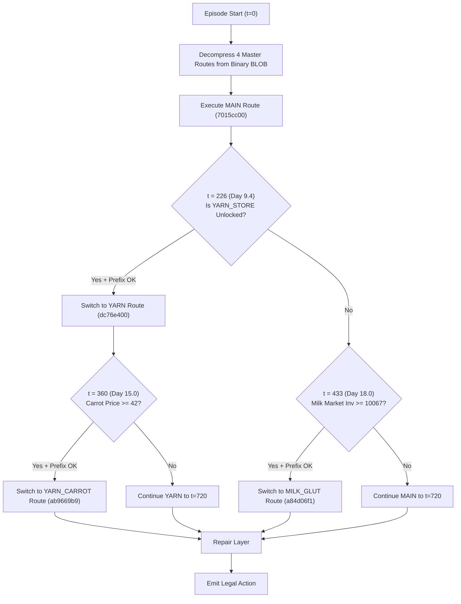

# 🔍 Chapter 2: Baseline Architecture Audit (2644.2)

## 1. Why Pure Online Planning & Pure RL Fail

In early competition iterations, many engineers attempted standard RL (PPO, SAC) or online forward simulation (Monte Carlo Tree Search). These approaches universally struggle in Kaggriculture for four reasons:

1. **Massive Action Space**: 
   $$\mathcal{A} = \mathcal{A}_{\text{farmer}} \times \prod_{i=1}^{N_{\text{hands}}} \mathcal{A}_{\text{hand}_i} \times \mathcal{A}_{\text{market}}$$
   On turns with 5 hired hands and 10 market slots, the instantaneous branching factor exceeds $10^{14}$ legal combinations.
2. **Extreme Horizon (720 Steps)**: 
   Agricultural investments made on Day 0 (e.g., pasture construction for $200 and cow purchase for $400) do not yield significant milk revenue until Day 10+. RL credit assignment over 720 steps with delayed rewards suffers severe gradient variance.
3. **Physical Spatial Constraints**: 
   Units block each other's pathing, the shed has a strict 100-item ceiling, and missing a single daily watering destroys an entire multi-day investment.
4. **Latency Budget**: 
   Online agents must return actions within strict Kaggle time limits. Running extensive MCTS simulations per turn is computationally intractable.

---

## 2. The Breakthrough: Replay-Based Public-State Routing

The 2644.2 baseline sidesteps combinatorial online search by **replaying full 720-turn action streams** recorded from top-tier ladder games. These recorded tapes already feature optimal unit micro-pathing, perfectly timed seed buying, crop watering schedules, and pasture management.



---

## 3. The 4 Master Route Tapes

The agent compresses four recorded master routes into a compact binary `_BLOB` (encoded via zlib and base64):

| Route | ID Hash | Diverges From | Physical Diverge Turn | Commodity Emphasis |
| :--- | :--- | :--- | :---: | :--- |
| **`MAIN`** | `7015cc00` | None (Root) | — | Balanced diversified portfolio: Wheat, Fertilizer, Wool, Milk, Melon, Strawberry. |
| **`YARN`** | `dc76e400` | `MAIN` | **t = 226** | Extreme Wool focus: 196 Wool (vs 131 in Main), 386 Wheat (vs 302), drops Egg. |
| **`YARN_CARROT`** | `ab9669b9` | `YARN` | **t = 360** | Adds 93 Carrots to capitalize on Pet Cafe / Farmers Market demand. |
| **`MILK_GLUT`** | `a84d06f1` | `MAIN` | **t = 577** | Egg-leaning variant (+79 Eggs), reduces Wool investment. |

### 3.1 The Binary BLOB Decompression Engine
To meet Kaggle's 100 MB file limit and keep submission size under 30 KB, routes are compressed using delta-encoding:

```python
def routes():
    global _ROUTES
    if _ROUTES is None:
        raw = zlib.decompress(base64.b64decode(_BLOB)).decode("utf-8")
        data = json.loads(raw)
        out = {data["root"]["h"]: data["root"]["tape"]}
        for t in data["tails"]:
            # Splice suffix onto parent tape at the exact diverge point
            out[t["h"]] = out[t["parent"]][:t["at"]] + t["suffix"]
        _ROUTES = out
    return _ROUTES
```

---

## 4. The Prefix Guard (`_switch_ok`)

Arbitrary tape splicing (e.g., executing Day 1–5 from Game A, then switching to Day 6–10 from Game B) is **universally fatal**:
* Farm tile layouts differ.
* Animal pasture locations differ.
* Unit coordinates diverge.
* If a unit attempts to water an unplanted tile or place an animal on bare dirt, the action is rejected by the engine, cascading into missed harvests and starvation.

The **Prefix Guard** guarantees mathematical safety:

```python
def _switch_ok(self, target, turn):
    """A switch is legal only onto a tail byte-identical to the current one so far."""
    a, b = self.R[self.cur], self.R[target]
    if a is b:
        return False
    for t in range(turn):
        if a[t] != b[t]:
            return False
    return True
```

Because all four routes in the BLOB share 100% identical histories up to their divergence points, switching introduces zero tile or inventory desync.

---

## 5. The Three Shipped Online Repairs

The baseline author evaluated dozens of runtime heuristics across a **968-game panel** (competing against top ladder bots #1, #3, #4, #5 and their historical opponents). Only three repairs demonstrated strictly positive results (**+19 Wins, 0 Losses**):

### 5.1 Repair 1: `weed_dig`
* **Trigger**: A unit's planned action on this turn is a no-op (or illegal), AND the unit is currently standing on a tile containing a `WEED`.
* **Action**: Overrides the action to `["DIG"]`.
* **Benefit**: Clears obstacles that block future crop planting without interfering with scheduled tasks.

### 5.2 Repair 2: `clamp_sells`
* **Trigger**: The route commands a `SELL <item> <qty>`, but the shed does not contain enough items to fulfill it (even after accounting for same-turn `DROP`/`PLACE` projections).
* **Action**: Clamps the sell quantity to available stock, or drops the order if stock is zero.
* **Benefit**: Each player has only 10 market order slots per turn. An unfillable sell burns a valuable slot. Clamping frees the slot for other transactions.

### 5.3 Repair 3: `dead_stock`
* **Trigger**: Items remain in the shed that the rest of the recorded route will never sell (`surplus = have - future_sells`).
* **Action**: Queues extra `SELL` orders for surplus produce in spare market slots, prioritized by descending expected value (`price * qty`).
* **Benefit**: Liquidation sweeps prevent thousands of coins from rotting in the shed at turn 720.

---

## 6. The Baseline's Anti-Pattern Graveyard

The baseline author specifically tested and permanently rejected several seemingly intuitive heuristics because they caused measurable regressions on the HOLD benchmark:

1. **Sells-Before-Buys Sorting**: **-17 HOLD Games**. Reordering market actions broke the route tape's delicate cash-flow sequence.
2. **Hire-Last Sorting**: **-13 HOLD Games**. Delayed farm hand hiring prevented hands from acting on the turn they were purchased.
3. **Deferring Unaffordable Buys**: Neutral or negative. Caused subsequent turn queues to choke.
4. **No-Op Feeding & Caring**: **-4 HOLD Games**. Caused animals to over-produce milk and wool, overflowing the 100-item shed capacity and causing valuable inventory to be permanently discarded!
